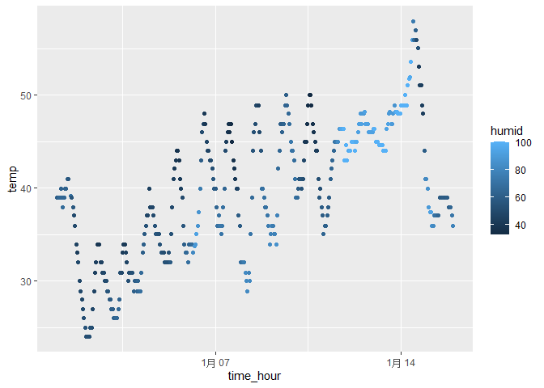

p8105_hw1_td2809
================
Chris Deng
2023-09-20

``` r
library(moderndive)
data("early_january_weather")
early_january_weather
```

    ## # A tibble: 358 × 15
    ##    origin  year month   day  hour  temp  dewp humid wind_dir wind_speed
    ##    <chr>  <int> <int> <int> <int> <dbl> <dbl> <dbl>    <dbl>      <dbl>
    ##  1 EWR     2013     1     1     1  39.0  26.1  59.4      270      10.4 
    ##  2 EWR     2013     1     1     2  39.0  27.0  61.6      250       8.06
    ##  3 EWR     2013     1     1     3  39.0  28.0  64.4      240      11.5 
    ##  4 EWR     2013     1     1     4  39.9  28.0  62.2      250      12.7 
    ##  5 EWR     2013     1     1     5  39.0  28.0  64.4      260      12.7 
    ##  6 EWR     2013     1     1     6  37.9  28.0  67.2      240      11.5 
    ##  7 EWR     2013     1     1     7  39.0  28.0  64.4      240      15.0 
    ##  8 EWR     2013     1     1     8  39.9  28.0  62.2      250      10.4 
    ##  9 EWR     2013     1     1     9  39.9  28.0  62.2      260      15.0 
    ## 10 EWR     2013     1     1    10  41    28.0  59.6      260      13.8 
    ## # ℹ 348 more rows
    ## # ℹ 5 more variables: wind_gust <dbl>, precip <dbl>, pressure <dbl>,
    ## #   visib <dbl>, time_hour <dttm>

The description of the dataset is:

``` r
str(early_january_weather)
```

    ## tibble [358 × 15] (S3: tbl_df/tbl/data.frame)
    ##  $ origin    : chr [1:358] "EWR" "EWR" "EWR" "EWR" ...
    ##  $ year      : int [1:358] 2013 2013 2013 2013 2013 2013 2013 2013 2013 2013 ...
    ##  $ month     : int [1:358] 1 1 1 1 1 1 1 1 1 1 ...
    ##  $ day       : int [1:358] 1 1 1 1 1 1 1 1 1 1 ...
    ##  $ hour      : int [1:358] 1 2 3 4 5 6 7 8 9 10 ...
    ##  $ temp      : num [1:358] 39 39 39 39.9 39 ...
    ##  $ dewp      : num [1:358] 26.1 27 28 28 28 ...
    ##  $ humid     : num [1:358] 59.4 61.6 64.4 62.2 64.4 ...
    ##  $ wind_dir  : num [1:358] 270 250 240 250 260 240 240 250 260 260 ...
    ##  $ wind_speed: num [1:358] 10.36 8.06 11.51 12.66 12.66 ...
    ##  $ wind_gust : num [1:358] NA NA NA NA NA NA NA NA NA NA ...
    ##  $ precip    : num [1:358] 0 0 0 0 0 0 0 0 0 0 ...
    ##  $ pressure  : num [1:358] 1012 1012 1012 1012 1012 ...
    ##  $ visib     : num [1:358] 10 10 10 10 10 10 10 10 10 10 ...
    ##  $ time_hour : POSIXct[1:358], format: "2013-01-01 01:00:00" "2013-01-01 02:00:00" ...

``` r
names(early_january_weather)
```

    ##  [1] "origin"     "year"       "month"      "day"        "hour"      
    ##  [6] "temp"       "dewp"       "humid"      "wind_dir"   "wind_speed"
    ## [11] "wind_gust"  "precip"     "pressure"   "visib"      "time_hour"

``` r
ncol(early_january_weather)
```

    ## [1] 15

``` r
nrow(early_january_weather)
```

    ## [1] 358

the mean temperature is

``` r
 mean(early_january_weather$temp)
```

    ## [1] 39.58212

``` r
library(tidyverse)
```

    ## ── Attaching core tidyverse packages ──────────────────────── tidyverse 2.0.0 ──
    ## ✔ dplyr     1.1.3     ✔ readr     2.1.4
    ## ✔ forcats   1.0.0     ✔ stringr   1.5.0
    ## ✔ ggplot2   3.4.3     ✔ tibble    3.2.1
    ## ✔ lubridate 1.9.2     ✔ tidyr     1.3.0
    ## ✔ purrr     1.0.2     
    ## ── Conflicts ────────────────────────────────────────── tidyverse_conflicts() ──
    ## ✖ dplyr::filter() masks stats::filter()
    ## ✖ dplyr::lag()    masks stats::lag()
    ## ℹ Use the conflicted package (<http://conflicted.r-lib.org/>) to force all conflicts to become errors

``` r
 p=ggplot(data=early_january_weather, aes(x=time_hour,y=temp,color=humid))
 p+geom_point()
```

<!-- --> The
horizontal axis represents time, the vertical axis represents
temperature, the color depth of the dots represents humidity, and the
lighter the color, the higher the humidity.

``` r
df=data.frame(x=rnorm(10),y=c(1,-2,3,4,-5,-6,7,-8,9,10)>0,z = c('1','2','3','4','5','6','7','8','9','10'),a=gl(3,3,length=10))
df
```

    ##              x     y  z a
    ## 1   0.07305761  TRUE  1 1
    ## 2   1.11926239 FALSE  2 1
    ## 3  -0.15833339  TRUE  3 1
    ## 4  -0.31197245  TRUE  4 2
    ## 5  -1.87456946 FALSE  5 2
    ## 6   1.54823453 FALSE  6 2
    ## 7  -2.64618611  TRUE  7 3
    ## 8  -0.09716095 FALSE  8 3
    ## 9  -1.43930440  TRUE  9 3
    ## 10  0.30690072  TRUE 10 1

We can take the mean of x:

``` r
mean_x=pull(df,x)
mean(mean_x)
```

    ## [1] -0.3480071

We can take the mean of y:

``` r
mean_y=pull(df,y)
mean(mean_y)
```

    ## [1] 0.6

We can’t take the mean of z:

``` r
mean_z=pull(df,z)
mean(mean_z)
```

    ## Warning in mean.default(mean_z): 参数不是数值也不是逻辑值：回覆NA

    ## [1] NA

We can’t take the mean of a:

``` r
mean_a=pull(df,a)
mean(mean_a)
```

    ## Warning in mean.default(mean_a): 参数不是数值也不是逻辑值：回覆NA

    ## [1] NA

The as.numeric() function in R is used to convert a character vector,a
logical vector and a factor vector into a numeric vector. Now we can
take the mean of y, z and a.

``` r
y1=as.numeric(mean_y)
z1=as.numeric(mean_z)
a1=as.numeric(mean_a)
```
